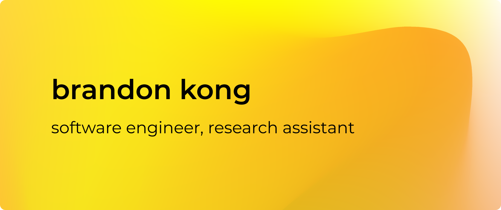

<h1 align="center">Hey there! I'm Brandon Kong 👋</h1>

I'm Brandon, a passionate software engineer/game developer currently studying Computer Science at DePaul University. I find myself exploring new technologies and learning new concepts every day. I'm always looking for new opportunities to grow and expand my knowledge.

I'm also a research assistant as part of the Motorola Solutions Foundation Program, where I work on Bioinformatics in the context of
brain stem nuclei segmentation using machine learning.

I am humbled to have been programming for over 6 years, and I've 
had the opportunity to work on some popular game titles, accumulating
millions of plays. 

Over the years, I've gained proficiency in **Java**, **Python**, **C++**, **JS/TS**, and **Lua**, but I've also worked on several projects using **C#**, **Rust**, **Go**, **PHP**, and **Scala**. Naturally, I picked up different web frameworks such as **Django**, **ASP.NET**, **Flask**, **FastAPI**, **Next.js**, **GoFiber**, **Express**, and more to come! 

One of the areas I find particurly interesting is user authentication and exploring robust ways of protecting user privacy and security. 

### What I'm listening to 🎧

